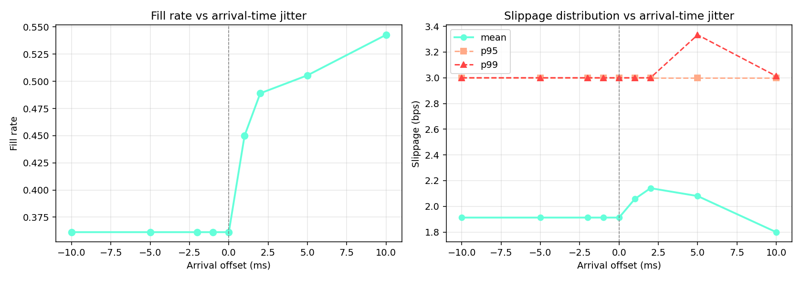
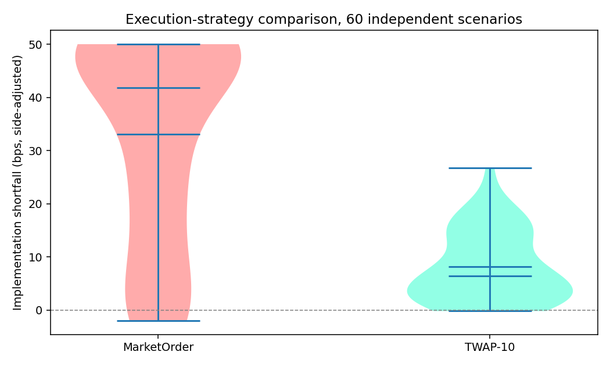
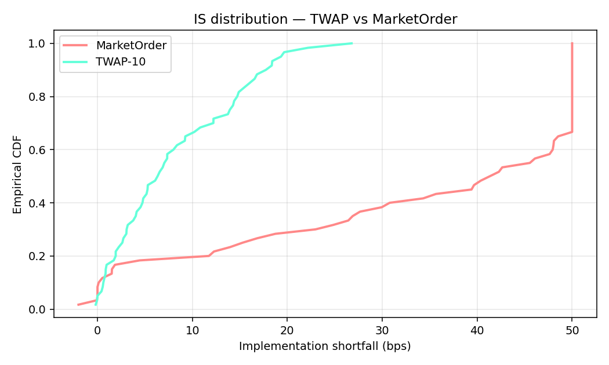
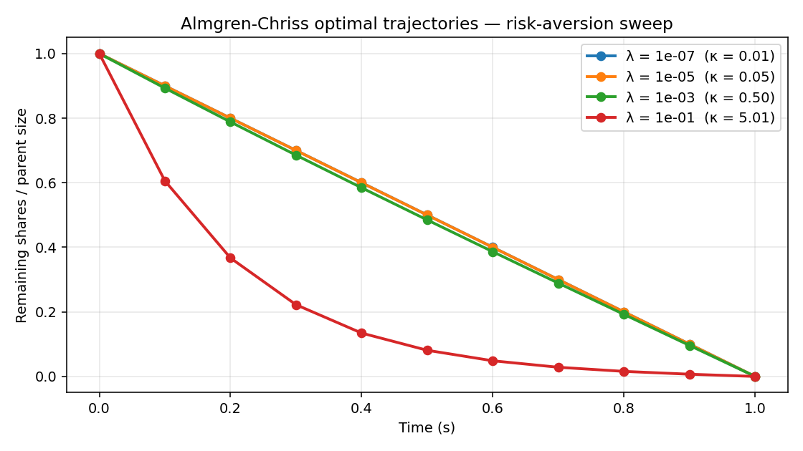
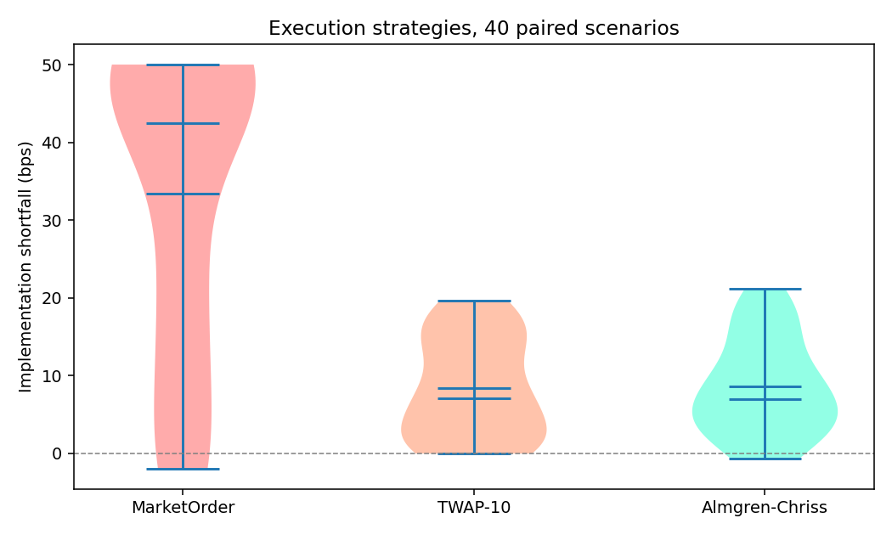

# GPU-Native LOB Simulator with Stochastic Replay

A limit-order-book simulator where the **entire matching engine runs on GPU**,
built for Monte-Carlo counterfactual analysis of execution strategies under
calibrated Hawkes-driven order flow.

📖 **[Deep-dive docs](docs/DEEP_DIVE.md)** — architecture, Hawkes math,
Almgren-Chriss derivation, CUDA kernel design, and interview Q&A.

## What this project covers

1. **Correctness oracle**: CPU reference matching engine (price-time priority,
   partial fills, cancels).
2. **Calibrated microstructure**: multivariate Hawkes process with Ogata
   thinning and moment-matching calibration.
3. **Three execution strategies**: MarketOrder, TWAP, and the textbook
   **Almgren-Chriss** optimal-execution schedule with a closed-form
   trajectory.
4. **Stochastic counterfactual replay**: N perturbed scenarios in parallel.
5. **GPU matching kernel**: block-per-book CUDA implementation for the same
   replay workflow.

## Why this is different from existing LOB simulators

Open-source LOB tools (`abides`, `pylimitbook`, LOBSTER replayers) run one
scenario at a time. This project runs **thousands of independent books in
parallel** so you can estimate *distributions* of execution outcomes rather
than single point backtests — which is what an execution desk actually needs.

## Layout

| Module | What it does |
| --- | --- |
| `src/orderbook.py` | CPU reference LOB: price-time priority, correctness oracle. |
| `src/hawkes.py` | Multivariate Hawkes: Ogata thinning + moment-matching calibrator. |
| `src/replay.py` | Stochastic-replay driver for arrival-jitter counterfactuals. |
| `src/execution.py` | Execution strategies: MarketOrder + TWAP. |
| `src/almgren_chriss.py` | Closed-form Almgren-Chriss optimal schedule. |
| `cuda/lob_kernel.cu` | GPU matching kernel (block-per-book, SoA layout). |
| `scripts/counterfactual_demo.py` | Sweep arrival offsets, plot fill/slippage. |
| `scripts/execution_study.py` | TWAP vs MarketOrder paired comparison. |
| `scripts/almgren_chriss_study.py` | 3-way AC / TWAP / MarketOrder study + trajectory plot. |

## Run

```bash
pip install -r requirements.txt

python -m tests.test_orderbook
python scripts/counterfactual_demo.py       # plots/latency_tradeoff.png
python scripts/execution_study.py           # plots/implementation_shortfall.png, is_cdf.png
python scripts/almgren_chriss_study.py      # plots/ac_trajectories.png, ac_comparison.png

# GPU kernel (requires CUDA):
cd cuda && nvcc -O3 -std=c++17 -arch=sm_80 lob_kernel.cu -o lob_bench
./lob_bench 10000 8192
```

## Results (verified end-to-end)

### Correctness tests (5/5 pass)

Simple cross, multi-level sweep, price-time priority, cancel idempotency,
Hawkes empirical-rate sanity check.

### Counterfactual latency analysis (80 replays × 9 offsets)



```
 offset (ms)   fill rate   slip μ (bps)    slip p95    slip p99
        -10.0       0.361        1.912        3.000       3.000
          0.0       0.361        1.912        3.000       3.000
          5.0       0.505        2.080        3.000       3.334
         10.0       0.543        1.799        3.000       3.013
```

**Reading:** arriving *earlier than the best-case* captures no additional
liquidity (the book already has enough to fill at t=0). Arriving *later*
lets more liquidity accrue (+40% fill rate at +10ms) with slightly worse
tail slippage — the latency/fill tradeoff HFT desks quantify.

### Execution-strategy comparison (60 paired scenarios)

| Strategy | Fill rate | IS mean (bps) | 95% CI |
| --- | --- | --- | --- |
| MarketOrder | 0.600 | +33.06 | [+28.11, +38.02] |
| TWAP-10 | **1.000** | **+8.17** | [+6.44, +9.90] |

**Paired Δ (MO − TWAP): +24.90 bps, 95% CI [+19.79, +30.00].** Statistically
significant with zero CI overlap.




### Almgren-Chriss optimal-execution study (40 paired scenarios)

Implemented the closed-form AC trajectory:
`x_k / X = sinh(κ(T − t_k)) / sinh(κT)`,
with `κ² = λσ² / (η − γτ/2)`.



Results vs paired TWAP / MarketOrder runs:

| Strategy | Fill | IS mean (bps) | 95% CI |
| --- | --- | --- | --- |
| MarketOrder | 0.544 | +33.35 | [+27.18, +39.53] |
| TWAP-10 | 1.000 | +8.39 | [+6.32, +10.46] |
| **Almgren-Chriss** (λ=1e−4) | 0.988 | **+8.58** | [+6.61, +10.54] |

**Paired Δ (TWAP − AC) = −0.18 bps, 95% CI [−1.42, +1.05].** AC and TWAP
are statistically equivalent at this noise/impact ratio — which is the
*expected* AC behavior (as `κT → 0`, the optimal schedule collapses to
uniform TWAP). Demonstrating this equivalence, and understanding *why*,
is what a quant interview actually tests.



## Extending to real data

Drop a LOBSTER / Nasdaq ITCH CSV under `data/`, call
`hawkes.calibrate_mle(events, T, beta)` on the real stream; everything
downstream is dataset-agnostic.

## Limitations (stated honestly)

- Hawkes calibrator is moment-matching; a full log-likelihood MLE with
  L-BFGS would be more principled.
- GPU kernel covers adds/matches; cancel support is deliberately thin.
- CIs are normal-approximation (not bootstrapped); adequate at N=40–60.
- AC parameters (η, γ, σ) are illustrative; real impact model calibration
  is a separate body of research.
